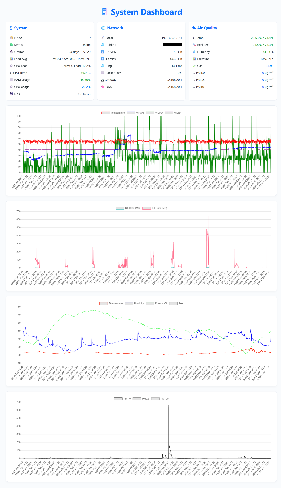

# Raspberry Pi System Monitoring Dashboard

A Flask-based web dashboard for monitoring system performance, WireGuard stats, network metrics, and external sensor/weather data on a Raspberry Pi.

[](#)

# Raspberry Pi System Monitoring Dashboard

A Flask-based web dashboard for monitoring system performance, WireGuard stats, network metrics, and external sensor/weather data on a Raspberry Pi.

---

## ⚙️ Features

### 🖥️ System Monitoring
- CPU Temperature  
- CPU Usage %  
- RAM Usage (used/total)  
- Disk Space (used/total and %)  
- Load Average (1, 5, 15 min)  
- System Uptime  
- Hostname and IP addresses  

### 🔐 WireGuard Statistics
- Transmitted (TX) Packets  
- Received (RX) Packets  
- TX/RX Deltas  

### 🌐 Network Diagnostics
- Local and Public IP  
- Online Status (via 1.1.1.1)  
- Gateway and DNS Servers  
- Ping Latency  
- Packet Loss %  

### 🌦️ Sensor and Weather Integration
- Sensor support (local HTTP endpoint)  
- NOAA Weather API integration  
- Logs:
  - Temperature, Humidity, Pressure, Gas  
  - PM10, PM2.5, PM100  

### 📁 Data Logging
- Logs data to CSV with rolling log (2560 lines)  
- Three separate CSVs: system, WireGuard, sensor/weather  

### 📡 JSON API Endpoints
- `/json_data`: System metrics (CPU, RAM, Disk)  
- `/json_dataWG`: WireGuard TX/RX and deltas  
- `/json_data_weather`: External sensor/weather data  
- `/json_system_info`: Realtime snapshot with network diagnostics  

---

## 🛠️ Requirements

- Python 3.x  
- Flask  
- Raspberry Pi OS or compatible Linux  
- PiVPN (WireGuard)  

---

## 🚀 Installation

1. **Clone the repository:**

   ```bash
   git clone https://github.com/your-username/system-monitoring-app.git
   cd system-monitoring-app
   ```

2. **Install required dependencies:**

   ```bash
   pip install flask requests
   ```

3. **Run the application:**

   ```bash
   python piMonitorWebServer.py
   ```

---

## 🌐 Usage

Open your browser and navigate to:

```
http://localhost:5005
```

You can also access it from any device on the same network using your Pi’s IP address.

---

## 📡 Endpoints

| Route                  | Description                                           |
|------------------------|-------------------------------------------------------|
| `/`                    | Main dashboard (includes PiVPN status)               |
| `/json_data`           | Returns recent system performance metrics (CSV→JSON) |
| `/json_dataWG`         | Returns WireGuard TX/RX + deltas                     |
| `/json_data_weather`   | Returns external sensor + weather data               |
| `/json_system_info`    | Returns live system and network info (no history)    |

---

## 🔧 Customization

You can tweak the following:
- CSV log length: change `MAX_LINES`  
- Monitoring interval: edit `time.sleep(300)` in `update_*` threads  
- Sensor/weather source URLs in `get_sensor_data()` and `get_weatherGOV_data()`  
- Add more endpoints via Flask if needed  

---

## 🤝 Contributing

Pull requests are welcome! For major changes, please open an issue first to discuss what you'd like to change or add.

---

## 📄 License

MIT License — see the `LICENSE` file for full details.
